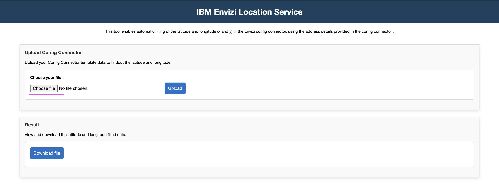
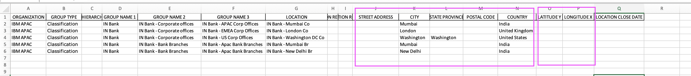
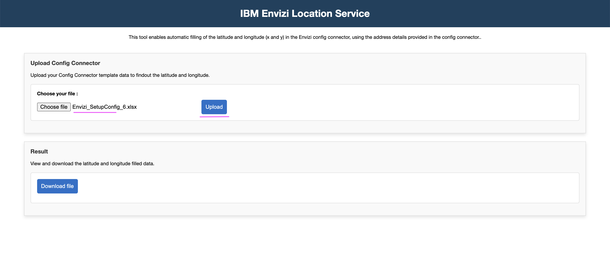
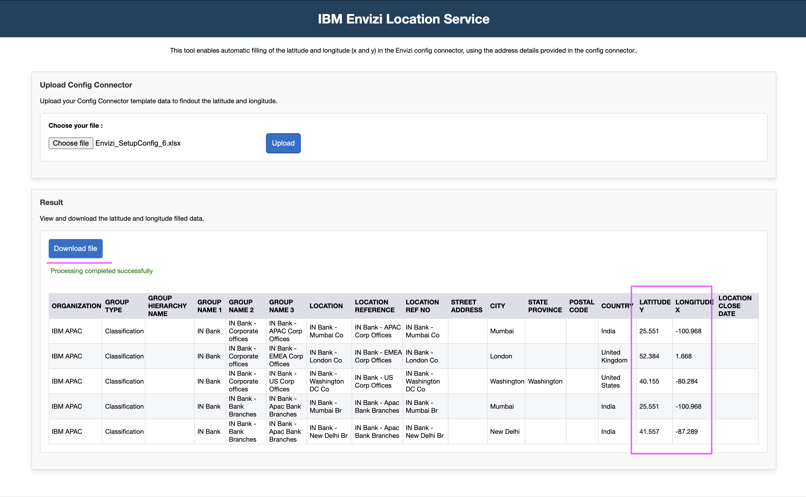
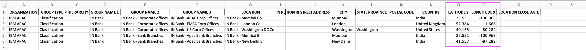

# Envizi Location Service

This tool enables automatic filling of the`LATITUDE Y` and `LONGITUDE X` columns in the Envizi Setup Config template, using the address details provided in the template.

Let'ss us look at how to install this application and run it.

## Prerequisite

Python 3.x should be installed and available.

## 1. Installation

#### 1.1 Download this repo

1. Download this repo (https://github.com/ibm-ecosystem-engineering/envizi-location-service). 

2. Let's assume the repository has been downloaded, and available in the location `/Users/xyz/envizi-location-service`.

    Let's call this as a root folder.

    Don't forget to replace the `/Users/xyz/envizi-location-service` with your folder structure, wherever we refer in this document.

#### 1.2 Create Python virtual environment

1. Open a new command or terminal window.

2. Goto the repository root folder by running the below command.

    **Note:** Don't forget to replace the `/Users/xyz/envizi-location-service` with your folder structure.

    ```
    cd /Users/xyz/envizi-location-service
    ```

3. Create python `virtual environment` by running the below command.

    ```
    python -m venv myvenv-location-svc
    source myvenv-location-svc/bin/activate
    ```

4. Install the required python packages by running the below command.
    ```
    python -m pip install -r requirements.txt
    ```

#### 1.3 Create .env file

1. Create `.env` file with the below entries (you should be still in the root folder of the repo /Users/xyz/envizi-location-service )

```
# Environment variables
LOGLEVEL = INFO

LOCATION_API_URL = "https://api.weather.com/v3/location/search"
LOCATION_API_KEY = ""

OUTPUT_FOLDER = "output"
WRITE_INTERIM_FILES=TRUE
```

2. Update the `LOCATION_API_URL` and `LOCATION_API_KEY` properties with your data.

They are weather API URL and key.

#### 1.4 Start the Python app

1. Run the below commands to start the app

    ```
    python src/main.py
 
    ```

2. Verify the app is working by opening the url  http://localhost:5001 in your browser.


## 2 Using the application

1. Open the url http://localhost:5001/ in the browser

2. Click on `Choose file` button to select your config connector template. 

    You can use the file - [data/Envizi_SetupConfig_6.xlsx](../data/Envizi_SetupConfig_6.xlsx)  

    

3. The selected file might look like this: it includes some filled `address-related` fields, but the `latitude` and `longitude` fields are left blank

    

4. Click on `Upload` to send the selected file to the server for processing.

    

5. The file got processed and the `latitude` and `longitude` fields are filled with the appropriate values based on the `address-related` fields.

6. Click on `Download file` button to download the processed excel file.

    

7. You can see the downloaded file contains the latitude and longitude fields values.

    

The sample file is available here - [data/Envizi_SetupConfig_6_result.xlsx](../data/Envizi_SetupConfig_6_result.xlsx)  
